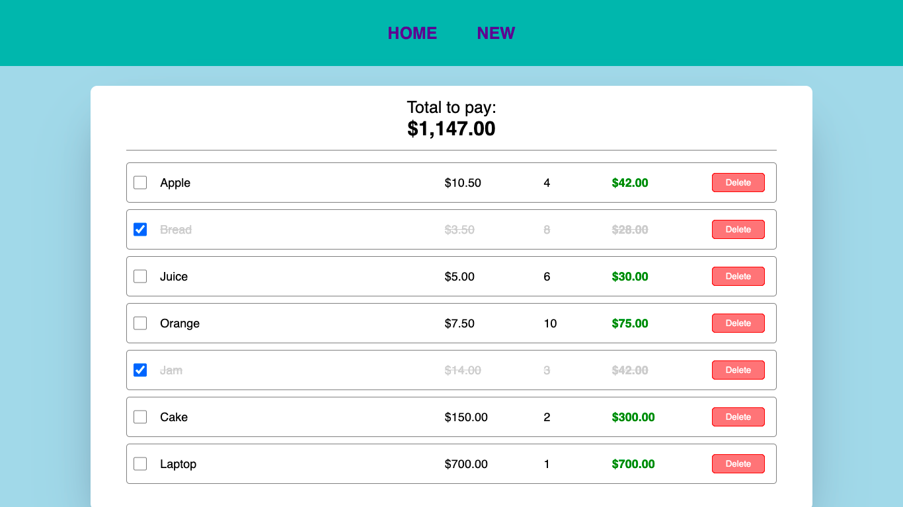

# Angular Shopping List

## Table of contents

- [Overview](#overview)
  - [The challenge](#the-challenge)
  - [Screenshot](#screenshot)
- [My process](#my-process)
  - [Built with](#built-with)
  - [What I learned](#what-i-learned)
  - [Continued development](#continued-development)
- [Author](#author)

## Overview

### The challenge

Users should be able to:

- View the page on a computer screen
- View a list of purchases with the ability to mark and delete them
- See a total price of the entire shopping list
- Add a new product to the shopping list

### Screenshot

## My process

### Built with

- HTML
- CSS
- Angular framework
- Typescript

### What I learned

On this page I learned to do a routing between several screens, I also learned to implement a complete filling form to save new products and finally to make a login to be able to add the products and to be able to eliminate them.

### Continued development

Implement a response design so that the page can be seen on devices with different screens and make use of localStorage to be able to keep the information even if the screen is refreshed.

## Author

Luis David Jimenez Martinez
- Portfolio - [www.luisdavidjm.com](https://www.luisdavidjm.com)
- GitHub - [LuisDavidJM](https://github.com/LuisDavidJM)
